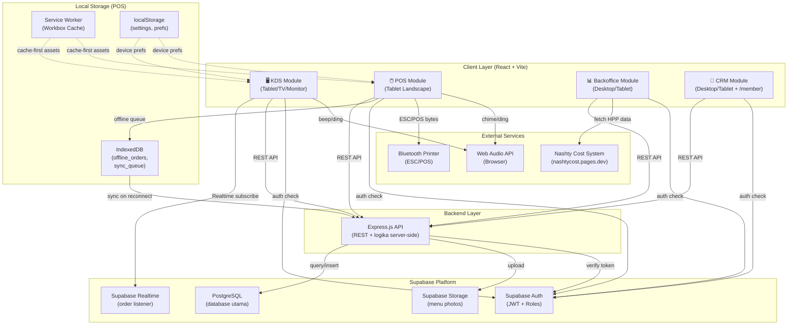
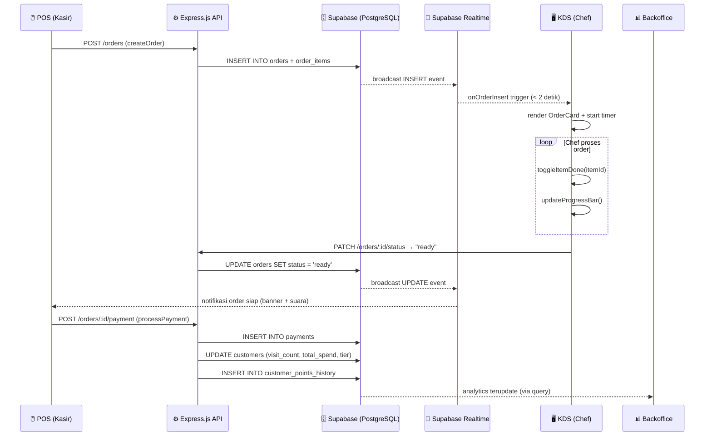
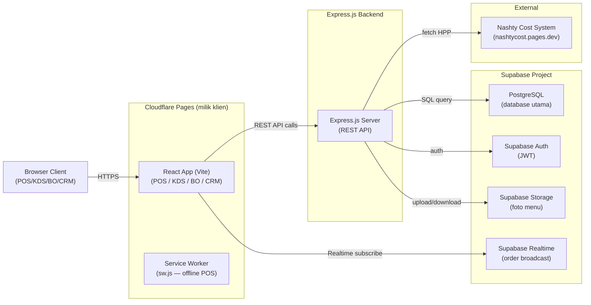
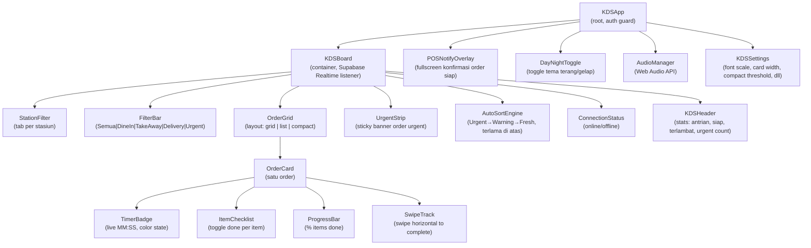
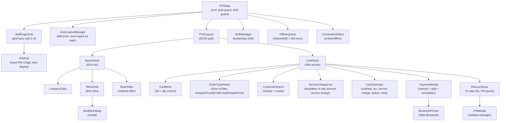
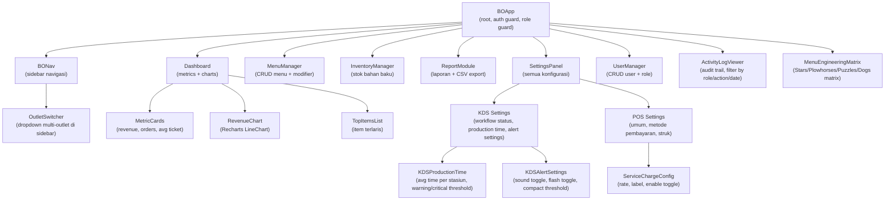
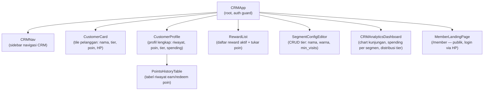
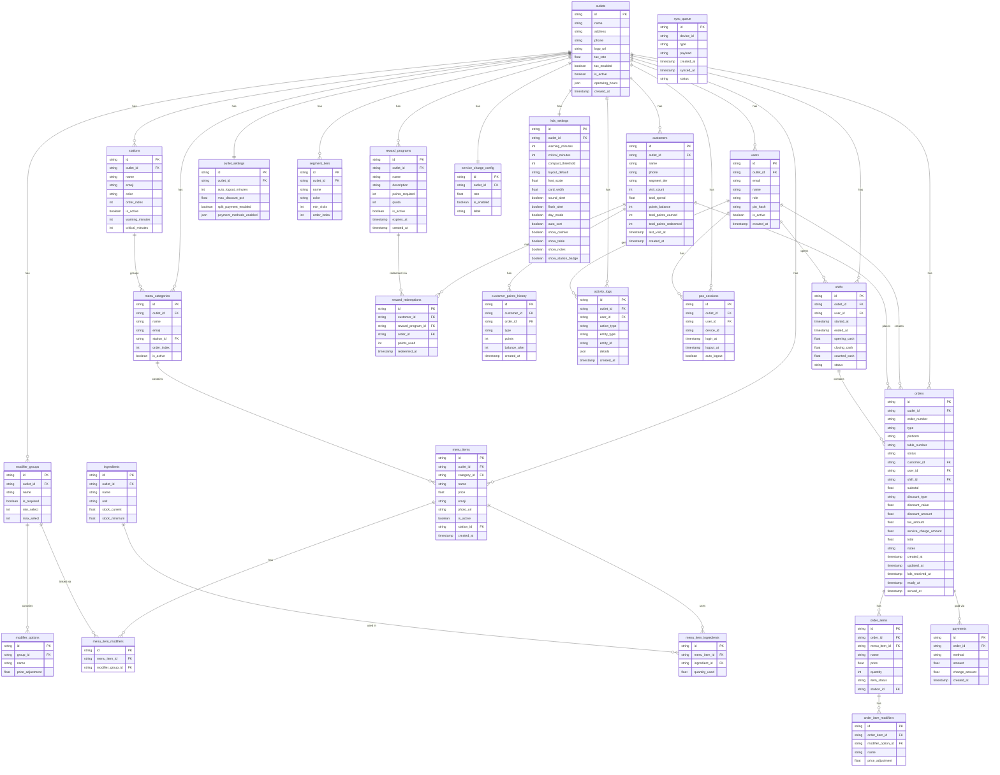

# Dokumen Desain Teknis — NASHTY OS

## Daftar Isi
1. [Overview](#overview)
2. [Architecture — Arsitektur Sistem](#architecture)
3. [Components and Interfaces — Komponen dan Antarmuka](#components-and-interfaces)
4. [Data Models — Model Data](#data-models)
5. [Correctness Properties — Properti Kebenaran](#correctness-properties)
6. [Error Handling — Penanganan Error](#error-handling)
7. [Testing Strategy — Strategi Pengujian](#testing-strategy)

## Overview

NASHTY OS adalah sistem manajemen F&B berbasis web yang terdiri dari empat modul terintegrasi:

- **KDS (Kitchen Display System)** — layar dapur yang menampilkan order aktif secara realtime kepada chef.
- **POS (Point of Sale Terminal)** — antarmuka kasir untuk input order, pembayaran, manajemen shift, dan cetak struk.
- **Backoffice** — dashboard analitik, manajemen menu, konfigurasi sistem, dan integrasi data HPP dari Nashty Cost System.
- **CRM (Customer Relationship Management)** — modul integrasi dengan NashtyPeople yang sudah live: pengelolaan database pelanggan, segmentasi tier dinamis, sistem reward points, member landing page, dan analitik loyalitas.

Keempat modul berbagi satu backend: **Express.js API** yang terhubung ke **Supabase** (PostgreSQL + Supabase Auth + Supabase Storage + Supabase Realtime). Mode offline pada POS menggunakan Service Worker + IndexedDB. Cetak struk menggunakan Web Bluetooth API (ESC/POS). Notifikasi audio menggunakan Web Audio API.

### Tujuan Teknis Utama

- Latensi order ke KDS < 2 detik via Supabase Realtime listener
- POS beroperasi penuh saat offline (IndexedDB + Service Worker)
- Sinkronisasi otomatis saat koneksi pulih
- Zero data loss: semua order harus dapat di-round-trip serialize/deserialize
- Keamanan berlapis: Supabase Auth + Row Level Security (RLS) per role

---

## Architecture

> Arsitektur Sistem NASHTY OS

### Tech Stack

| Layer | Teknologi | Alasan |
|---|---|---|
| Frontend Framework | React (Vite) | SPA ringan, build cepat, tidak butuh SSR |
| UI Library | React 18 + Tailwind CSS | Component-based, utility-first styling |
| Routing | React Router v6 | Client-side routing SPA |
| State Management | Zustand | Ringan, cocok untuk cart state POS |
| Backend | Express.js | REST API, logika server-side, integrasi eksternal |
| Database | Supabase (PostgreSQL) | Relational, RLS, realtime built-in |
| Auth | Supabase Auth | JWT, multi-role, integrasi RLS |
| Storage | Supabase Storage | Upload foto menu (max 2MB) |
| Realtime | Supabase Realtime | Listener order KDS (pengganti Firestore listener) |
| Offline Storage | IndexedDB (via idb library) | Transaksi offline POS |
| Service Worker | Workbox | Cache strategi, background sync |
| Bluetooth | Web Bluetooth API | Koneksi printer termal ESC/POS |
| Audio | Web Audio API | Notifikasi suara KDS & POS |
| Charts | Recharts | Grafik analitik Backoffice |
| Hosting | Cloudflare Pages | Hosting frontend (milik klien) |
| Testing (Unit/PBT) | Vitest + fast-check | Property-based testing |

### 2.2 Diagram Arsitektur High-Level



### 2.3 Data Flow Diagram — Order Lifecycle



### 2.4 Deployment Architecture



Express.js bertanggung jawab untuk semua logika server-side: pembuatan nomor order unik, validasi server-side, dan integrasi eksternal. API key dan credential sensitif tidak pernah terekspos di client bundle.

---

## Components and Interfaces

> Komponen dan Antarmuka per Modul

### 3.1 Modul KDS



#### Interface Komponen Kunci KDS

```typescript
// OrderCard Props
interface OrderCardProps {
  order: Order;
  settings: KDSSettings;
  isCompact: boolean;
  onSwipeComplete: (orderId: string) => Promise<void>;
  onToggleItem: (orderId: string, itemId: string) => void;
}

// SwipeTrack — gestur swipe horizontal untuk selesaikan order
interface SwipeTrackProps {
  urgencyColor: string; // fill color saat swipe, mengikuti urgency state
  onComplete: () => void;
  label?: string; // default "Swipe →"
}

// UrgentStrip — sticky banner semua order urgent
interface UrgentStripProps {
  urgentOrders: Pick<Order, 'id' | 'order_number'>[];
  onClickOrder: (orderId: string) => void; // scroll ke kartu
}

// TimerBadge — menentukan color state berdasarkan elapsed time
interface TimerBadgeProps {
  createdAt: Timestamp;
  warningMinutes: number;  // default 10
  criticalMinutes: number; // default 20
}

type TimerState = 'normal' | 'warning' | 'critical';
// normal: elapsed < warningMinutes
// warning: warningMinutes <= elapsed < criticalMinutes
// critical: elapsed >= criticalMinutes

// DayNightToggle — simpan preferensi ke localStorage per device
interface DayNightToggleProps {
  value: 'day' | 'night';
  onChange: (mode: 'day' | 'night') => void;
}

// AutoSortEngine — pure function, sort order berdasarkan prioritas
function autoSortOrders(orders: Order[], criticalMinutes: number, warningMinutes: number): Order[];
// Urutan: critical → warning → normal, kemudian by created_at ascending (terlama di atas)

// POSNotifyOverlay — fullscreen overlay di POS saat KDS swipe complete
interface POSNotifyOverlayProps {
  order: Order | null; // null = overlay tersembunyi
  onConfirm: (orderId: string) => Promise<void>; // ubah status → "disajikan"
}

// AudioManager — Web Audio API wrapper
interface AudioManagerAPI {
  playOrderIn(): void;       // ding — order baru masuk KDS
  playOrderReady(): void;    // double-ding — order siap
  playCriticalAlert(): void; // beep loop — timer kritis
  playPaymentSuccess(): void;// chime — pembayaran berhasil
  setEnabled(enabled: boolean): void;
  isEnabled(): boolean;
}
```

### 3.2 Modul POS



#### Interface Komponen Kunci POS

```typescript
// StaffLoginGrid — halaman login PIN-based
interface StaffLoginGridProps {
  staffList: StaffCard[];
  onSelectStaff: (staffId: string) => void;
}

interface StaffCard {
  id: string;
  name: string;
  initials: string;
  role: 'kasir' | 'manager';
  isActive: boolean;
}

// PINPad — input PIN 4 digit
interface PINPadProps {
  staffName: string;
  onConfirm: (pin: string) => Promise<void>;
  onBack: () => void;
  error?: string; // pesan error jika PIN salah
}

// AutoLogoutManager — idle timer
interface AutoLogoutManagerProps {
  idleDurationMs: number; // dikonfigurasi dari Backoffice
  onLogout: () => void;
}

// ServiceChargeLine — baris service charge di cart summary
interface ServiceChargeLineProps {
  subtotal: number;
  serviceChargeRate: number;   // persentase, misal 0.05 = 5%
  isEnabled: boolean;
  label: string; // misal "Service Charge (5%)"
}

// Cart State (Zustand store)
interface CartState {
  items: CartItem[];
  orderType: OrderType; // 'dine_in' | 'take_away' | 'gofood' | 'grabfood' | 'shopee'
  tableNumber: string | null;
  customer: CustomerRef | null;
  discountType: 'percent' | 'nominal' | null;
  discountValue: number;
  notes: string;
  addItem(item: MenuItem, modifiers: ModifierOption[]): void;
  removeItem(itemId: string): void;
  updateQuantity(itemId: string, delta: number): void;
  clear(): void;
  getSubtotal(): number;
  getTaxAmount(taxRate: number): number;
  getServiceChargeAmount(serviceChargeRate: number): number;
  getDiscountAmount(): number;
  getTotal(taxRate: number, serviceChargeRate: number): number;
}

type OrderType = 'dine_in' | 'take_away' | 'gofood' | 'grabfood' | 'shopee';

// BluetoothPrinter API
interface BluetoothPrinterAPI {
  connect(): Promise<void>;
  disconnect(): void;
  printReceipt(receipt: ReceiptData): Promise<void>;
  isConnected(): boolean;
  onDisconnect(callback: () => void): void;
}

// OfflineQueue API
interface OfflineQueueAPI {
  enqueue(entry: SyncQueueEntry): Promise<void>;
  processQueue(): Promise<SyncResult[]>;
  getPendingCount(): Promise<number>;
  onConflict(callback: (conflict: ConflictEntry) => void): void;
}
```

### 3.3 Modul Backoffice



### 3.4 Modul CRM

Modul CRM adalah aplikasi terpisah (`CRMApp`) yang dapat diakses dari Backoffice maupun URL langsung. Halaman publik `/member` dapat diakses oleh pelanggan tanpa login.



#### Interface Komponen Kunci CRM

```typescript
// CustomerCard — tile di daftar pelanggan
interface CustomerCardProps {
  customer: Customer;
  segmentTier: SegmentTier;
  onViewProfile: (customerId: string) => void;
}

// CustomerProfile — halaman profil lengkap
interface CustomerProfileProps {
  customerId: string;
  // render: info dasar, poin, tier, total_spend, visit_count, riwayat transaksi
}

// PointsHistoryTable — riwayat poin per pelanggan
interface PointsHistoryTableProps {
  customerId: string;
  // entries: CustomerPointsHistory[]
}

// RewardList — daftar program reward
interface RewardListProps {
  outletId: string;
  customerId?: string; // jika ada, tampilkan apakah pelanggan bisa tukar
  onRedeem?: (programId: string, customerId: string) => Promise<void>;
}

// SegmentConfigEditor — CRUD tier segmentasi dinamis
interface SegmentConfigEditorProps {
  outletId: string;
  tiers: SegmentTier[];
  onSave: (tiers: SegmentTier[]) => Promise<void>;
}

interface SegmentTier {
  id: string;
  outlet_id: string;
  name: string;        // contoh: "New", "Regular", "VIP", "VVIP"
  color: string;       // hex color untuk badge
  min_visits: number;  // threshold kunjungan minimum
  order_index: number; // urutan tier (0 = terendah)
}

// MemberLandingPage — halaman publik /member
// Login via nomor HP, tampilkan: saldo poin, tier, total_spend, visit_count,
// riwayat transaksi terbaru, daftar reward yang tersedia
```

---

## Data Models

> Model Data — ERD, Supabase Table Structure (PostgreSQL), dan Skema Entitas

### 4.1 Entity Relationship Diagram (ERD)



### 4.2 Supabase Table Structure (PostgreSQL)

Karena menggunakan PostgreSQL relational, data diorganisasi dalam tabel dengan foreign key dan Row Level Security (RLS):

```sql
-- Semua tabel menggunakan UUID sebagai primary key (gen_random_uuid())
-- Kolom outlet_id sebagai scope multi-outlet di sebagian besar tabel

-- Core
CREATE TABLE outlets ( id uuid PK, name, address, phone, logo_url, tax_rate, tax_enabled, is_active, operating_hours jsonb, created_at );
CREATE TABLE users ( id uuid PK, outlet_id FK, email, name, role, pin_hash, is_active, created_at );
-- role: 'owner' | 'manager' | 'kasir' | 'chef'

-- Menu
CREATE TABLE stations ( id uuid PK, outlet_id FK, name, emoji, color, order_index, is_active, warning_minutes, critical_minutes );
CREATE TABLE menu_categories ( id uuid PK, outlet_id FK, station_id FK, name, emoji, order_index, is_active );
CREATE TABLE menu_items ( id uuid PK, outlet_id FK, category_id FK, station_id FK, name, price, emoji, photo_url, is_active, created_at );
CREATE TABLE modifier_groups ( id uuid PK, outlet_id FK, name, is_required, min_select, max_select );
CREATE TABLE modifier_options ( id uuid PK, group_id FK, name, price_adjustment );
CREATE TABLE menu_item_modifiers ( id uuid PK, menu_item_id FK, modifier_group_id FK );
CREATE TABLE ingredients ( id uuid PK, outlet_id FK, name, unit, stock_current, stock_minimum );
CREATE TABLE menu_item_ingredients ( id uuid PK, menu_item_id FK, ingredient_id FK, quantity_used );

-- Operasional
CREATE TABLE shifts ( id uuid PK, outlet_id FK, user_id FK, started_at, ended_at, opening_cash, closing_cash, counted_cash, status );
CREATE TABLE orders (
  id uuid PK, outlet_id FK, order_number text UNIQUE,
  type text,  -- 'dine_in' | 'take_away' | 'gofood' | 'grabfood' | 'shopee'
  table_number, status, customer_id FK, user_id FK, shift_id FK,
  subtotal, discount_type, discount_value, discount_amount,
  tax_amount, service_charge_amount, total, notes,
  created_at, updated_at, kds_received_at, ready_at, served_at
);
CREATE TABLE order_items ( id uuid PK, order_id FK, menu_item_id FK, name text, price numeric, quantity int, item_status, station_id FK );
CREATE TABLE order_item_modifiers ( id uuid PK, order_item_id FK, modifier_option_id FK, name text, price_adjustment numeric );
CREATE TABLE payments ( id uuid PK, order_id FK, method, amount, change_amount, created_at );

-- Konfigurasi
CREATE TABLE kds_settings ( id uuid PK, outlet_id FK UNIQUE, warning_minutes, critical_minutes, compact_threshold, layout_default, font_scale, card_width, sound_alert, flash_alert, day_mode, auto_sort, show_cashier, show_table, show_notes, show_station_badge );
CREATE TABLE service_charge_config ( id uuid PK, outlet_id FK UNIQUE, rate, is_enabled, label );
CREATE TABLE outlet_settings ( id uuid PK, outlet_id FK UNIQUE, auto_logout_minutes, max_discount_pct, split_payment_enabled, payment_methods_enabled jsonb );

-- CRM / Loyalitas
CREATE TABLE customers ( id uuid PK, outlet_id FK, name, phone, segment_tier_id FK, visit_count, total_spend, points_balance, total_points_earned, total_points_redeemed, last_visit_at, created_at );
CREATE TABLE segment_tiers ( id uuid PK, outlet_id FK, name, color, min_visits, order_index );
CREATE TABLE reward_programs ( id uuid PK, outlet_id FK, name, description, points_required, quota, is_active, expires_at, created_at );
CREATE TABLE reward_redemptions ( id uuid PK, customer_id FK, reward_program_id FK, order_id FK, points_used, redeemed_at );
CREATE TABLE customer_points_history ( id uuid PK, customer_id FK, order_id FK, type text, points int, balance_after int, created_at );

-- Audit & Sesi
CREATE TABLE activity_logs ( id uuid PK, outlet_id FK, user_id FK, action_type, entity_type, entity_id, details jsonb, created_at );
CREATE TABLE pos_sessions ( id uuid PK, outlet_id FK, user_id FK, device_id, login_at, logout_at, auto_logout );
CREATE TABLE sync_queue ( id uuid PK, device_id, type, payload jsonb, created_at, synced_at, status );
```

#### Strategi Data di PostgreSQL

Beberapa pola penting dalam skema relasional ini:

- `order_items.name` dan `order_items.price` adalah **snapshot** saat order dibuat — tidak berubah meskipun harga menu diubah nanti. Ini tetap relevan di PostgreSQL.
- `order_item_modifiers` menyimpan snapshot `name` dan `price_adjustment` — tidak perlu join ke `modifier_options` untuk keperluan display order historis.
- `orders.type` menyimpan nilai `'dine_in' | 'take_away' | 'gofood' | 'grabfood' | 'shopee'` — memungkinkan filter di KDS dan laporan tanpa join tambahan.
- `customers.segment_tier_id` FK ke `segment_tiers` — tier dihitung ulang (recalculate) saat konfigurasi tier berubah.
- RLS (Row Level Security) Supabase menggantikan Firestore Security Rules — setiap tabel dilindungi policy per role.

---

### 4.3 Desain Sistem Audio (Web Audio API)

```typescript
// AudioManager menggunakan AudioContext untuk generate suara programatik
// tanpa bergantung pada file audio eksternal

class AudioManager {
  private ctx: AudioContext | null = null;
  private enabled: boolean;

  constructor() {
    // Baca preferensi dari localStorage per device
    this.enabled = localStorage.getItem('audio_enabled') !== 'false';
  }

  // Harus dipanggil dari user interaction pertama (autoplay policy)
  private async ensureContext(): Promise<AudioContext> {
    if (!this.ctx || this.ctx.state === 'closed') {
      this.ctx = new AudioContext();
    }
    if (this.ctx.state === 'suspended') {
      await this.ctx.resume();
    }
    return this.ctx;
  }

  // ORDER_IN — ding singkat (440Hz, 0.3 detik)
  async playOrderIn(): Promise<void> { /* oscillator 440Hz, type: sine */ }

  // ORDER_READY — double-ding (440Hz + 550Hz, 0.2 + 0.2 detik)
  async playOrderReady(): Promise<void> { /* dua oscillator berurutan */ }

  // CRITICAL_ALERT — beep keras (800Hz, square wave, berulang 3x)
  async playCriticalAlert(): Promise<void> { /* oscillator 800Hz, type: square */ }

  // PAYMENT_SUCCESS — chime naik (do-mi-sol, 0.15 detik each)
  async playPaymentSuccess(): Promise<void> { /* 3 oscillator: 261, 329, 392 Hz */ }

  setEnabled(enabled: boolean): void {
    this.enabled = enabled;
    localStorage.setItem('audio_enabled', String(enabled));
  }
}
```

**Autoplay Policy Handling:**
- AudioContext harus diinisialisasi dari user gesture (tap, klik)
- Pada mount pertama KDS/POS, tampilkan UI prompt "Aktifkan audio" yang memicu inisialisasi
- Jika audio tidak diizinkan browser, fallback ke visual badge (pulsating red dot)

### 4.4 Desain Bluetooth Printing (Web Bluetooth API)

```typescript
// Flow: requestDevice → connect GATT → getService → getCharacteristic → writeValue

class BluetoothPrinterManager {
  private device: BluetoothDevice | null = null;
  private characteristic: BluetoothRemoteGATTCharacteristic | null = null;

  // Nama service/characteristic umum untuk printer ESC/POS Bluetooth
  private SERVICE_UUID = '000018f0-0000-1000-8000-00805f9b34fb';
  private CHAR_UUID    = '00002af1-0000-1000-8000-00805f9b34fb';

  async connect(): Promise<void> {
    this.device = await navigator.bluetooth.requestDevice({
      filters: [{ services: [this.SERVICE_UUID] }],
      // Fallback: acceptAllDevices jika service UUID tidak dikenal
    });
    const server = await this.device.gatt!.connect();
    const service = await server.getPrimaryService(this.SERVICE_UUID);
    this.characteristic = await service.getCharacteristic(this.CHAR_UUID);

    this.device.addEventListener('gattserverdisconnected', this.handleDisconnect);
  }

  async printReceipt(data: ReceiptData): Promise<void> {
    const bytes = ESCPOSEncoder.encode(data); // encode ke ESC/POS byte array
    // Kirim dalam chunk 512 bytes (batas MTU Bluetooth)
    for (let i = 0; i < bytes.length; i += 512) {
      await this.characteristic!.writeValueWithResponse(bytes.slice(i, i + 512));
    }
  }

  // Timeout 15 detik, retry max 3x
  async printWithRetry(data: ReceiptData, maxRetries = 3): Promise<void> {
    for (let attempt = 1; attempt <= maxRetries; attempt++) {
      try {
        await Promise.race([
          this.printReceipt(data),
          new Promise((_, reject) => setTimeout(() => reject(new Error('Timeout')), 15000))
        ]);
        return;
      } catch (err) {
        if (attempt === maxRetries) throw err;
        await this.reconnect();
      }
    }
  }
}
```

**ESC/POS Commands yang digunakan:**
- `ESC @` — initialize printer
- `ESC a` — text alignment (center/left)
- `ESC E` — bold on/off
- `GS !` — text size
- `LF` — line feed
- `ESC d` — print and feed n lines
- `GS V` — cut paper (partial cut)

**Browser Compatibility:**
- Chrome Desktop (v56+): ✅ Didukung penuh
- Chrome Android (v56+): ✅ Didukung penuh
- Firefox: ❌ Tidak didukung (no Web Bluetooth)
- Safari: ❌ Tidak didukung
- Edge (Chromium): ✅ Didukung

Tampilkan warning pada browser yang tidak didukung dan arahkan ke Chrome.

### 4.5 Desain Mode Offline (Service Worker + IndexedDB)

#### Service Worker Strategy (Workbox)

```javascript
// sw.js — menggunakan Workbox untuk cache strategy

// Cache-first: semua static assets (JS, CSS, fonts, images)
registerRoute(
  ({ request }) => request.destination === 'script' || 'style' || 'font' || 'image',
  new CacheFirst({ cacheName: 'nashty-static-v1', /* maxEntries: 100 */ })
);

// Network-first: API calls ke Express.js backend
// Jika offline, fallback ke data yang tersimpan di IndexedDB

// Background Sync — untuk sinkronisasi antrian offline ke Express.js API
self.addEventListener('sync', (event) => {
  if (event.tag === 'sync-offline-orders') {
    event.waitUntil(processOfflineQueue());
  }
});
```

#### IndexedDB Schema (via `idb` library)

```typescript
// Database: nashty-offline-db v1
const db = await openDB('nashty-offline-db', 1, {
  upgrade(db) {
    // Store 1: order yang dibuat saat offline
    const offlineOrders = db.createObjectStore('offline_orders', { keyPath: 'localId' });
    offlineOrders.createIndex('by_status', 'syncStatus');

    // Store 2: antrian sinkronisasi umum
    const syncQueue = db.createObjectStore('sync_queue', { keyPath: 'id', autoIncrement: true });
    syncQueue.createIndex('by_status', 'status');
    syncQueue.createIndex('by_device', 'deviceId');

    // Store 3: cache data read-only (menu, settings)
    db.createObjectStore('menu_cache', { keyPath: 'id' });
    db.createObjectStore('settings_cache', { keyPath: 'id' });
  }
});
```

#### Offline Order Numbering

```
Format offline: SNY-OFF-{deviceId_6char}-{timestamp_ms}-{seq_2digit}
Contoh: SNY-OFF-A3B2C1-1704067200000-01

Saat sinkronisasi:
1. Order offline dikirim ke Express.js API (POST /orders/sync)
2. Express.js menghasilkan nomor order resmi: SNY-XXXX (auto-increment per outlet per hari)
3. Local reference di-update dengan nomor resmi
4. Tampilkan ke kasir: "Order SNY-OFF-... → SNY-0147 (synced)"
```

#### Conflict Resolution

```
Strategi: Last-Write-Wins dengan notifikasi Manager

1. Saat sync, Express.js cek apakah order dengan ID yang sama sudah ada di Supabase
2. Jika TIDAK ada → INSERT langsung (no conflict)
3. Jika ADA → bandingkan timestamp updated_at
   - Jika offline lebih baru → UPDATE (last-write-wins)
   - Jika Supabase lebih baru → simpan ke conflict log
4. Catat semua conflict ke tabel sync_queue dengan status: 'conflict'
5. Tampilkan badge notifikasi di Backoffice untuk Manager
```

#### Data yang Di-cache untuk Offline

| Data | Store | TTL | Alasan |
|---|---|---|---|
| Menu items | `menu_cache` | 1 jam | Diperlukan untuk input order |
| Menu categories | `menu_cache` | 1 jam | Diperlukan untuk navigasi |
| KDS settings | `settings_cache` | 30 menit | Konfigurasi tampilan |
| Outlet settings | `settings_cache` | 1 jam | Tax rate untuk kalkulasi |

---

### 4.6 State Management

#### POS — Cart State (Zustand)

```typescript
// Zustand store untuk cart — persisted ke sessionStorage
const useCartStore = create<CartState>()(
  persist(
    (set, get) => ({
      items: [],
      orderType: 'dine_in' as OrderType, // 'dine_in' | 'take_away' | 'gofood' | 'grabfood' | 'shopee'
      tableNumber: null,
      customer: null,
      // ... actions
    }),
    { name: 'nashty-cart', storage: createJSONStorage(() => sessionStorage) }
  )
);
```

#### KDS — Realtime State (Supabase Realtime)

```typescript
// KDSBoard: subscribe ke semua order aktif per outlet via Supabase Realtime
const channel = supabase
  .channel(`orders:${outletId}`)
  .on(
    'postgres_changes',
    {
      event: '*',
      schema: 'public',
      table: 'orders',
      filter: `outlet_id=eq.${outletId}`,
    },
    (payload) => {
      // INSERT: order baru masuk
      if (payload.eventType === 'INSERT') {
        addOrUpdateOrder(payload.new as Order);
      }
      // UPDATE: status berubah (in_progress, ready, dll)
      if (payload.eventType === 'UPDATE') {
        addOrUpdateOrder(payload.new as Order);
      }
    }
  )
  .subscribe();

// Filter order aktif: status 'new' | 'in_progress' | 'ready'
// platform mencakup: 'dine_in' | 'take_away' | 'gofood' | 'grabfood' | 'shopee'
```

#### Settings — Supabase → localStorage Cache

```typescript
// Saat load pertama, fetch dari Supabase via Express API
// Simpan ke localStorage dengan timestamp
// Selanjutnya gunakan cache, refresh setiap 30 menit atau saat ada update
const SETTINGS_CACHE_KEY = 'nashty_kds_settings';
const CACHE_TTL = 30 * 60 * 1000; // 30 menit
```

### 4.7 Security Design

#### Supabase Authentication

```
- Provider: Email/Password (via Supabase Auth)
- JWT token refresh otomatis oleh Supabase SDK
- Custom claims untuk role: { role: 'owner' | 'manager' | 'kasir' | 'chef', outlet_id: string }
- Custom claims di-set via Express.js API saat user dibuat/diupdate
- POS dan KDS menggunakan PIN-based auth (validasi di Express.js, bukan Supabase Auth langsung)
```

#### Supabase Row Level Security (RLS)

```sql
-- Aktifkan RLS di semua tabel sensitif
ALTER TABLE orders ENABLE ROW LEVEL SECURITY;
ALTER TABLE users ENABLE ROW LEVEL SECURITY;
ALTER TABLE menu_items ENABLE ROW LEVEL SECURITY;
-- dst. untuk semua tabel

-- Helper: ambil role dari JWT claim
CREATE OR REPLACE FUNCTION auth_role() RETURNS text AS $$
  SELECT current_setting('request.jwt.claims', true)::json->>'role';
$$ LANGUAGE sql STABLE;

-- Helper: ambil outlet_id dari JWT claim
CREATE OR REPLACE FUNCTION auth_outlet_id() RETURNS uuid AS $$
  SELECT (current_setting('request.jwt.claims', true)::json->>'outlet_id')::uuid;
$$ LANGUAGE sql STABLE;

-- Policy: orders — kasir/chef/manager/owner bisa baca order outlet sendiri
CREATE POLICY "orders_read" ON orders
  FOR SELECT USING (
    outlet_id = auth_outlet_id()
    AND auth_role() IN ('owner', 'manager', 'kasir', 'chef')
  );

-- Policy: orders — hanya kasir ke atas yang bisa buat order
CREATE POLICY "orders_insert" ON orders
  FOR INSERT WITH CHECK (
    outlet_id = auth_outlet_id()
    AND auth_role() IN ('owner', 'manager', 'kasir')
  );

-- Policy: orders — kasir dan chef bisa update status; manager/owner bisa delete (void)
CREATE POLICY "orders_update" ON orders
  FOR UPDATE USING (
    outlet_id = auth_outlet_id()
    AND auth_role() IN ('owner', 'manager', 'kasir', 'chef')
  );

-- Policy: menu_items — hanya manager/owner yang bisa write
CREATE POLICY "menu_items_write" ON menu_items
  FOR ALL USING (
    outlet_id = auth_outlet_id()
    AND auth_role() IN ('owner', 'manager')
  );

-- Policy: activity_logs — immutable (tidak bisa update/delete dari client)
CREATE POLICY "activity_logs_read" ON activity_logs
  FOR SELECT USING (
    outlet_id = auth_outlet_id()
    AND auth_role() IN ('owner', 'manager')
  );
CREATE POLICY "activity_logs_insert" ON activity_logs
  FOR INSERT WITH CHECK (outlet_id = auth_outlet_id());
-- UPDATE dan DELETE tidak ada policy → selalu ditolak

-- Policy: users — hanya manager/owner bisa baca; hanya owner bisa write
CREATE POLICY "users_read" ON users
  FOR SELECT USING (
    outlet_id = auth_outlet_id()
    AND auth_role() IN ('owner', 'manager')
  );
CREATE POLICY "users_write" ON users
  FOR ALL USING (
    outlet_id = auth_outlet_id()
    AND auth_role() = 'owner'
  );
```

#### PIN Manager

```typescript
// PIN untuk aksi sensitif (void, diskon besar)
// Disimpan sebagai bcrypt hash di tabel users (Supabase/PostgreSQL)

const PIN_CONFIG = {
  maxAttempts: 3,
  lockoutDurationMs: 5 * 60 * 1000, // 5 menit
  saltRounds: 10,
};

// State lockout disimpan di memory (per session)
// Setelah 3 kali salah, PIN modal terkunci 5 menit
```

---

## Correctness Properties

> Properti Kebenaran — Properti Universal yang Dapat Diuji

*Sebuah properti adalah karakteristik atau perilaku yang harus berlaku di semua eksekusi sistem yang valid — sebuah pernyataan formal tentang apa yang seharusnya dilakukan sistem. Properti berfungsi sebagai jembatan antara spesifikasi yang dapat dibaca manusia dan jaminan kebenaran yang dapat diverifikasi secara otomatis.*

Bagian ini merinci properti-properti universal yang dapat diuji menggunakan property-based testing. Berdasarkan prework analisis, NASHTY OS memiliki logika bisnis yang kaya (serialisasi order, segmentasi pelanggan, kalkulasi timer, rendering kondisional) yang sangat cocok untuk property-based testing menggunakan **fast-check** (library PBT untuk TypeScript/JavaScript).

### Catatan Refleksi Properti (Deduplikasi)

Sebelum menetapkan properti final, berikut konsolidasi dari prework:

- **2.2, 2.3, 2.4** (timer color states) → digabung menjadi satu **Properti 2** yang mencakup semua 3 state sekaligus.
- **3.1, 3.2** (toggle item done/undone) → digabung menjadi satu **Properti 3** karena 3.2 adalah round-trip dari 3.1.
- **22.1, 22.2, 22.3** (serialisasi order) → **Properti 6** sebagai round-trip mencakup ketiganya; **Properti 7** untuk validasi skema.
- **16.2 dan 16.3** → dua properti terpisah karena menguji logika yang berbeda (kalkulasi tier vs. update data).

---

### Property 1: Rendering Field Order Card Sesuai Konfigurasi

*Untuk semua* kombinasi objek `Order` yang valid dan konfigurasi `KDSSettings`, field yang ditampilkan pada `OrderCard` harus tepat mencerminkan flag konfigurasi: jika `show_cashier = false` maka nama kasir tidak muncul, jika `show_table = false` maka nomor meja tidak muncul, jika `show_notes = false` maka catatan tidak muncul, dan jika `show_station_badge = false` maka badge stasiun tidak muncul — dan sebaliknya, jika flag `true` maka field tersebut wajib muncul.

**Validates: Requirements 1.2, 1.6**

---

### Property 2: Penentuan Color State Timer Berdasarkan Elapsed Time

*Untuk semua* nilai `elapsedMinutes` (bilangan positif), `warningMinutes` (bilangan positif), dan `criticalMinutes > warningMinutes`, fungsi `getTimerState(elapsed, warning, critical)` harus mengembalikan:
- `'normal'` jika `elapsed < warning`
- `'warning'` jika `warning <= elapsed < critical`
- `'critical'` jika `elapsed >= critical`

Dan tidak ada nilai input valid yang dapat menghasilkan state di luar tiga kategori tersebut.

**Validates: Requirements 2.2, 2.3, 2.4**

---

### Property 3: Toggle Item Done adalah Involutif (Round-Trip)

*Untuk semua* order item dengan state `done: boolean`, memanggil `toggleItemDone(item)` dua kali berturut-turut harus menghasilkan state yang identik dengan state awal. Dengan kata lain, `toggle(toggle(item)).done === item.done`.

**Validates: Requirements 3.1, 3.2**

---

### Property 4: Kalkulasi Progress Bar Mencerminkan Rasio Item Selesai

*Untuk semua* array `OrderItem[]` dengan panjang N ≥ 1, fungsi `calculateProgress(items)` harus mengembalikan nilai antara 0.0 dan 1.0 inklusif, di mana nilai tersebut sama persis dengan `count(items, i => i.done) / N`. Khususnya, jika semua item `done = false` hasilnya 0.0, dan jika semua item `done = true` hasilnya 1.0.

**Validates: Requirements 3.3**

---

### Property 5: Counter TERLAMBAT Akurat untuk Semua Kombinasi Order

*Untuk semua* list `Order[]` dengan berbagai nilai `elapsedMinutes` dan nilai `criticalMinutes` yang sama, fungsi `countLateOrders(orders, criticalMinutes)` harus mengembalikan nilai yang tepat sama dengan jumlah order yang `elapsedMinutes >= criticalMinutes`.

**Validates: Requirements 2.5**

---

### Property 6: Round-Trip Serialisasi Order (Parse ∘ Serialize = Identity)

*Untuk semua* objek `Order` yang valid (termasuk nested `orderItems`, `modifiers`, semua tipe order, semua status), melakukan serialize ke format PostgreSQL row kemudian parse kembali harus menghasilkan objek yang ekuivalen secara nilai (`deepEqual(parse(serialize(order)), order) === true`). Properti ini harus berlaku untuk semua kombinasi field opsional (nullable fields, empty arrays, special characters dalam notes/nama).

**Validates: Requirements 22.1, 22.2, 22.3**

---

### Property 7: Parser Menolak Row Order yang Tidak Valid dengan Error Deskriptif

*Untuk semua* row PostgreSQL yang melanggar skema order (field wajib hilang, tipe data salah, nilai di luar enum yang valid), fungsi `parseOrderRow(row)` harus:
1. Tidak pernah melempar unhandled exception
2. Mengembalikan `Result<Order, ParseError>` dengan `isError = true`
3. `ParseError.message` harus berisi string yang non-empty (deskriptif)

Dokumen valid tidak boleh menghasilkan error.

**Validates: Requirements 22.4**

---

### Property 8: Validasi Semua Dokumen Antrian Offline Sebelum Sync

*Untuk semua* kumpulan `SyncQueueEntry[]` yang mengandung campuran entri valid dan invalid, fungsi `processSyncQueue(entries)` harus memastikan:
- Setiap entri valid tersimpan ke Supabase via Express.js API (status menjadi `'synced'`)
- Setiap entri invalid ditolak tanpa memodifikasi database (status menjadi `'error'`)
- Tidak ada entri yang dilewati tanpa diperiksa (semua entri diproses)

**Validates: Requirements 22.5, 11.5**

---

### Property 9: Segmentasi Pelanggan Konsisten untuk Semua Nilai Kunjungan

*Untuk semua* nilai `visit_count` (bilangan bulat positif) dan konfigurasi `SegmentTiers[]` yang valid (minimal 2 tier, ordered by `min_visits` ascending), fungsi `calculateSegmentTier(visitCount, tiers)` harus:
- Mengembalikan tier dengan `min_visits` tertinggi yang masih `<= visitCount`
- Tidak pernah mengembalikan `null` selama terdapat setidaknya satu tier dengan `min_visits = 0` atau `min_visits <= visitCount`
- Selalu konsisten: input yang sama menghasilkan output yang sama

**Validates: Requirements 25.2, 26.1, 26.2**

---

### Property 10: Update Transaksi Selalu Meningkatkan Metrik Pelanggan

*Untuk semua* objek `Customer` dan `Order` yang valid dengan `order.total > 0`, menerapkan `applyTransactionToCustomer(customer, order)` harus menghasilkan customer baru di mana:
- `result.visit_count === customer.visit_count + 1`
- `result.total_spend === customer.total_spend + order.total`
- `result.last_visit_at >= customer.last_visit_at`
- `result.segment_tier === calculateSegmentTier(result.visit_count, tiers)` (tier di-recalculate)

**Validates: Requirements 25.3**

---

### Property 11: Kalkulasi Reward Points Konsisten

*Untuk semua* nilai transaksi positif dan formula reward yang valid, fungsi `calculateEarnedPoints(orderTotal, formula)` harus:
- Selalu mengembalikan bilangan bulat non-negatif
- Hasil bernilai 0 jika `orderTotal` di bawah threshold minimum formula
- Proporsional: transaksi yang lebih besar menghasilkan poin yang sama atau lebih banyak

**Validates: Requirements 27.1**

---

### Property 12: Penukaran Poin Tidak Melampaui Saldo

*Untuk semua* pelanggan dengan `points_balance ≥ 0` dan program reward dengan `points_required > 0`, fungsi `redeemPoints(customer, program)` harus:
- Berhasil (mengurangi `points_balance`) jika dan hanya jika `customer.points_balance >= program.points_required`
- Gagal dengan error deskriptif jika `customer.points_balance < program.points_required`
- `result.points_balance === customer.points_balance - program.points_required` jika berhasil
- `result.total_points_redeemed === customer.total_points_redeemed + program.points_required` jika berhasil

**Validates: Requirements 27.4, 27.5**

---

### Property 13: Service Charge Kalkulasi Selalu Akurat

*Untuk semua* nilai `subtotal ≥ 0` dan `serviceChargeRate` antara 0.0 dan 1.0, fungsi `calculateServiceCharge(subtotal, rate, isEnabled)` harus:
- Mengembalikan `0` jika `isEnabled = false`, terlepas dari nilai `subtotal` dan `rate`
- Mengembalikan `subtotal * rate` (dibulatkan ke 2 desimal) jika `isEnabled = true`
- `total = subtotal + taxAmount + serviceChargeAmount - discountAmount` harus selalu konsisten

**Validates: Requirements 8.5, 23.3**

---

## Error Handling

> Penanganan Error per Modul dan Kategori

### 6.1 Kategori Error dan Strategi

| Kategori | Contoh | Strategi |
|---|---|---|
| Network / Supabase | Koneksi terputus, timeout API | Tampilkan `ConnectionStatus` indicator, POS fallback ke IndexedDB |
| Bluetooth Printer | Device tidak ditemukan, GATT disconnect, timeout | Retry 3x dengan backoff, tawarkan skip/cetak ulang |
| Authentication | Token kadaluarsa, akun dinonaktifkan | Redirect ke halaman login, clear local state |
| Data Validation | Order tidak lengkap, schema mismatch | `ParseError` dengan pesan deskriptif, jangan tampilkan UI yang rusak |
| Offline Sync | Conflict saat merge | Last-write-wins + catat ke conflict log + notifikasi Manager |
| PIN | Salah PIN > 3x | Lockout 5 menit, log attempt ke activity_logs |
| Upload Foto | File > 2MB, format tidak didukung | Validasi sebelum upload, pesan error spesifik |
| Reward Points | Saldo tidak cukup saat redeem | Return error deskriptif dengan kekurangan poin, jangan kurangi saldo |
| Activity Logs | Gagal tulis log | Log error ke console, jangan blokir operasi utama (fire-and-forget) |
| Service Charge | Rate config tidak ditemukan | Fallback ke rate 0%, tampilkan warning di POS |
| CRM / MemberPage | Lookup via HP tidak ditemukan | Pesan ramah "Nomor tidak terdaftar", tawarkan daftar baru |

### 6.2 Error Boundaries (React)

Setiap modul utama (KDSBoard, POSLayout, BOApp) dibungkus `ErrorBoundary` React:

```typescript
// Jika komponen crash, tampilkan fallback UI — bukan layar putih kosong
<ErrorBoundary fallback={<ModuleErrorFallback moduleName="KDS" />}>
  <KDSBoard />
</ErrorBoundary>
```

### 6.3 Error Handling Supabase Realtime Listener

```typescript
const channel = supabase
  .channel(`orders:${outletId}`)
  .on('postgres_changes', { event: '*', schema: 'public', table: 'orders' }, handleOrderChange)
  .subscribe((status, error) => {
    if (status === 'SUBSCRIBED') {
      setConnectionStatus('online');
    }
    if (status === 'CHANNEL_ERROR' || status === 'TIMED_OUT') {
      setConnectionStatus('offline');
      console.error('Supabase Realtime error:', error);
      // KDS: tampilkan last known state dengan banner "Data mungkin tidak terkini"
      // POS: fallback ke polling atau IndexedDB cache
    }
    if (status === 'CLOSED') {
      // Channel ditutup — coba reconnect
      setConnectionStatus('reconnecting');
    }
  });
```

### 6.4 Graceful Degradation per Modul

**KDS:**
- Offline → tampilkan banner kuning "Mode Offline — data mungkin tidak terkini"
- Jika audio context suspended → tampilkan visual badge merah berkedip sebagai pengganti suara
- Jika Supabase Realtime error → tampilkan last known orders dengan timestamp "terakhir diperbarui: HH:mm"

**POS:**
- Offline → banner merah "Mode Offline — transaksi disimpan lokal"
- Bluetooth disconnect → modal dengan opsi "Coba Lagi" atau "Lewati Pencetakan"
- Pembayaran gagal → pertahankan state cart penuh, tampilkan error deskriptif
- Shift belum dibuka → blokir semua transaksi, arahkan ke ShiftManager

**Backoffice:**
- Timeout query analytics → tampilkan skeleton loader, tombol "Coba Lagi"
- Upload foto gagal → rollback ke foto sebelumnya, tampilkan pesan error
- ActivityLogs query timeout → tampilkan pesan error dengan tombol reload
- MenuEngineeringMatrix: data penjualan kosong → tampilkan state kosong dengan panduan

**CRM:**
- Customer lookup gagal → tampilkan pesan error, pertahankan form input
- Reward redeem gagal karena saldo tidak cukup → tampilkan kekurangan poin secara eksplisit
- SegmentTier recalculate timeout → tampilkan progress bar, notifikasi setelah selesai
- MemberLandingPage offline → tampilkan data terakhir dari cache dengan timestamp "data per HH:mm"

---

## Testing Strategy

> Strategi Pengujian — Unit Test, Property-Based Test, dan Integration Test

### 7.1 Pendekatan Pengujian Dual

NASHTY OS menggunakan kombinasi dua pendekatan pengujian yang saling melengkapi:

1. **Unit Tests (example-based)**: menguji contoh spesifik, kondisi edge case, dan integrasi antar komponen
2. **Property-Based Tests (PBT)**: menguji properti universal yang harus berlaku untuk semua input valid

Library yang digunakan: **Vitest** (test runner) + **fast-check** (property-based testing) + **React Testing Library** (komponen UI).

### 7.2 Property-Based Tests

Setiap properti kebenaran (Bagian 5) diimplementasikan sebagai satu test PBT dengan **minimum 100 iterasi**.

Konfigurasi fast-check:

```typescript
// vitest.config.ts
import { defineConfig } from 'vitest/config';
export default defineConfig({
  test: {
    globals: true,
    environment: 'jsdom',
  }
});

// Contoh implementasi PBT — Properti 2: Timer Color State
// Feature: nashty-os, Property 2: Timer color state berdasarkan elapsed time
import { fc, test } from '@fast-check/vitest';
import { getTimerState } from '@/lib/kds/timer';

test.prop([
  fc.nat({ max: 120 }),               // elapsedMinutes: 0–120
  fc.integer({ min: 1, max: 30 }),    // warningMinutes: 1–30
  fc.integer({ min: 2, max: 60 }),    // criticalMinutes: 2–60
])('Properti 2: timer color state benar untuk semua kombinasi waktu', (elapsed, warning, critical) => {
  fc.pre(critical > warning); // precondition: critical harus lebih besar dari warning

  const state = getTimerState(elapsed, warning, critical);

  if (elapsed < warning) expect(state).toBe('normal');
  else if (elapsed < critical) expect(state).toBe('warning');
  else expect(state).toBe('critical');
}, { numRuns: 500 }); // 500 iterasi untuk coverage yang lebih baik
```

```typescript
// Contoh implementasi PBT — Properti 6: Round-trip serialisasi order
// Feature: nashty-os, Property 6: Order serialization round trip
import { fc, test } from '@fast-check/vitest';
import { serializeOrder, parseOrderRow } from '@/lib/supabase/serializers';
import { arbitraryOrder } from '@/test/arbitraries/order';

test.prop([arbitraryOrder()])
  ('Properti 6: serialize lalu parse order menghasilkan objek yang ekuivalen', (order) => {
    const serialized = serializeOrder(order);
    const result = parseOrderRow(serialized);

    expect(result.isOk()).toBe(true);
    expect(result.value).toStrictEqual(order);
  }, { numRuns: 200 });
```

```typescript
// Contoh implementasi PBT — Properti 9: Segmentasi pelanggan (tier dinamis)
// Feature: nashty-os, Property 9: Customer segmentation consistency (dynamic tiers)
import { fc, test } from '@fast-check/vitest';
import { calculateSegmentTier } from '@/lib/crm/segmentation';

// Generate SegmentTiers yang valid: minimal 2 tier, ordered by min_visits ascending
const arbitrarySegmentTiers = fc.array(
  fc.record({
    id: fc.string(),
    name: fc.string({ minLength: 1 }),
    color: fc.hexaString({ minLength: 6, maxLength: 6 }).map(s => `#${s}`),
    min_visits: fc.nat({ max: 100 }),
    order_index: fc.nat({ max: 10 }),
  }),
  { minLength: 2, maxLength: 6 }
).map(tiers =>
  [...tiers].sort((a, b) => a.min_visits - b.min_visits)
    .map((t, i) => ({ ...t, order_index: i }))
);

test.prop([
  fc.integer({ min: 1, max: 1000 }), // visit_count
  arbitrarySegmentTiers,
])('Properti 9: segmentasi pelanggan konsisten untuk tier dinamis', (visitCount, tiers) => {
  const tier = calculateSegmentTier(visitCount, tiers);

  expect(tier).not.toBeNull();
  // Tier yang dikembalikan harus tier tertinggi yang masih <= visitCount
  const eligibleTiers = tiers.filter(t => t.min_visits <= visitCount);
  if (eligibleTiers.length > 0) {
    const expectedTier = eligibleTiers[eligibleTiers.length - 1];
    expect(tier?.id).toBe(expectedTier.id);
  }
}, { numRuns: 300 });
```

### 7.3 Unit Tests (Example-Based)

Unit test mencakup kasus-kasus yang tidak cocok untuk PBT:

**KDS:**
- OrderCard menampilkan semua field dengan data lengkap (contoh spesifik)
- UrgentStrip muncul ketika ada order urgent, hilang ketika tidak ada
- SwipeTrack trigger onComplete setelah swipe horizontal penuh
- POSNotifyOverlay tampil setelah swipe complete, tutup setelah konfirmasi
- DayNightToggle menyimpan preferensi ke localStorage dan bertahan setelah reload
- AutoSortEngine: urutan output Urgent → Warning → Fresh, terlama di atas dalam setiap grup
- ConnectionStatus menampilkan indikator saat Supabase Realtime disconnect disimulasikan
- AudioManager: mock AudioContext, verifikasi suara yang tepat dipanggil per event
- Tombol swipe complete bisa dieksekusi meskipun tidak semua item di-check (edge case)
- Compact Mode aktif otomatis saat jumlah order ≥ compact_threshold (default 12)

**POS:**
- StaffLoginGrid menampilkan grid kartu staf dengan nama, inisial, dan role
- PINPad: input 4 digit menampilkan dots, tombol konfirmasi aktif setelah digit ke-4
- PINPad: PIN salah menampilkan error tanpa mengunci akun
- AutoLogoutManager: logout triggered setelah idle melebihi durasi konfigurasi
- ServiceChargeLine: tampil jika is_enabled = true, tidak tampil jika false
- Cart total = subtotal + tax + service_charge - discount (beberapa contoh angka)
- OrderTypePicker: GoFood/GrabFood/ShopeeFood tersedia sebagai pilihan tipe
- Menambah item dengan modifier wajib menampilkan ModifierDialog
- Mengurangi kuantitas ke 0 menghapus item dari cart
- Split payment: total semua metode harus sama dengan total order
- Shift belum dibuka memblokir akses ke transaksi
- BluetoothPrinter: mock Web Bluetooth API, verifikasi bytes yang dikirim
- Receipt mencantumkan service_charge jika ada

**Backoffice:**
- OutletSwitcher: berpindah outlet memuat data outlet yang berbeda
- ActivityLogViewer: filter by role/action/date menampilkan log yang sesuai
- MenuEngineeringMatrix: item diklasifikasi ke Stars/Plowhorses/Puzzles/Dogs berdasarkan data penjualan
- KDSProductionTime: mengonfigurasi warning/critical threshold per stasiun
- KDSAlertSettings: compact_threshold, sound toggle, flash toggle tersimpan ke Supabase
- Item menu nonaktif tidak muncul di response query POS
- Alert low stock muncul saat stok < minimum
- Ekspor CSV menghasilkan file dengan header yang benar

**CRM:**
- CustomerCard menampilkan nama, tier, poin, dan nomor HP pelanggan
- CustomerProfile menampilkan poin, riwayat transaksi, dan tier yang benar
- PointsHistoryTable menampilkan entri earn dan redeem dalam urutan terbaru
- RewardList: reward tidak aktif tidak tampil; reward expired tidak tampil
- SegmentConfigEditor: tidak bisa hapus tier jika hanya tersisa 2 tier (edge case)
- SegmentConfigEditor: save tier baru memicu recalculate tier semua pelanggan
- MemberLandingPage: login via nomor HP, menampilkan data poin dan tier pelanggan
- MemberLandingPage: daftar reward tersedia dengan biaya poin yang benar

**Auth:**
- User dengan role 'chef' redirect ke KDS saat mencoba akses Backoffice
- User dengan role 'kasir' tidak bisa mengakses `/backoffice` route
- pos_sessions dicatat saat login dan update saat logout/auto-logout

### 7.4 Integration Tests

Dijalankan secara terpisah menggunakan Supabase local emulator / test environment:

- Order dibuat di POS muncul di KDS dalam < 2 detik (Supabase Realtime listener)
- Perubahan status order di KDS tercermin di POS (POSNotifyOverlay muncul)
- Perubahan konfigurasi di Backoffice teraplikasi ke KDS dalam < 30 detik
- Antrian offline tersinkronisasi setelah koneksi dipulihkan (via Express.js sync endpoint)
- Pengurangan stok otomatis saat order diproses
- Poin reward ter-accumulate di customer setelah transaksi selesai
- Penukaran reward mengurangi saldo poin dan mencatat ke customer_points_history
- Activity log dibuat setelah: login, void order, perubahan menu, perubahan konfigurasi
- pos_sessions dibuat saat login POS dan diupdate saat logout/auto-logout
- MemberLandingPage (/member): lookup via nomor HP menampilkan data pelanggan yang benar
- SegmentTiers update memicu recalculate tier semua pelanggan di outlet

### 7.5 Smoke Tests

- Aplikasi load dalam < 3 detik pada broadband 10 Mbps
- Supabase Auth login berhasil dengan kredensial valid
- KDS dapat dibuka di 2 tab bersamaan dengan data sinkron (Supabase Realtime)
- Bluetooth printer terdeteksi dan terhubung di Chrome (jika hardware tersedia)

### 7.6 Coverage Targets

| Layer | Target Coverage |
|---|---|
| Fungsi bisnis murni (serializer, segmentasi, timer, kalkulasi, reward points) | ≥ 90% |
| React components | ≥ 75% (via RTL) |
| Integration flows | Semua happy path + 2 error path |
| Properti PBT | 100% properti yang didefinisikan di Bagian 5 (13 properti) |

### 7.7 Konfigurasi PBT

```typescript
// Semua property test menggunakan konfigurasi default minimum ini
const PBT_CONFIG = {
  numRuns: 100,        // minimum per properti
  seed: undefined,     // random seed (reproducible jika test gagal: fast-check log seed)
  verbose: true,       // log counterexample saat gagal
};

// Tag format untuk setiap property test:
// "Feature: nashty-os, Property N: <deskripsi singkat>"
```

---

*Dokumen desain ini merupakan panduan implementasi utama NASHTY OS. Semua keputusan teknis yang signifikan harus merujuk ke dokumen ini. Perubahan pada arsitektur, model data, atau properti kebenaran harus diperbarui di dokumen ini sebelum diimplementasikan.*

> Revisi terakhir: Mencerminkan stack teknologi baru (Firebase → Supabase PostgreSQL, Next.js 14 → React Vite, Cloud Functions → Express.js). Penambahan modul CRM (integrasi NashtyPeople yang sudah live), entitas ERD baru (reward_programs, reward_redemptions, customer_points_history, activity_logs, pos_sessions, segment_tiers, service_charge_config), komponen KDS/POS/Backoffice baru, Supabase table structure (menggantikan Firestore collection structure), Supabase RLS (menggantikan Firestore Security Rules), OrderType diperluas ke GoFood/GrabFood/ShopeeFood, dan 3 correctness properties tambahan (Property 11–13). WhatsApp/broadcast dihapus sesuai SOW v2.


---
